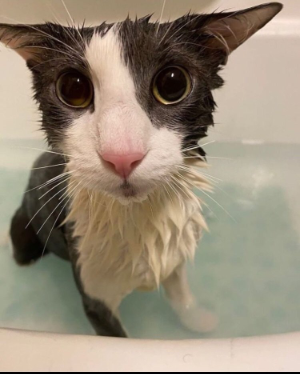

# SerhiiUI

> **BETA, EXTREMELY BUGGY!** Use if you want issues (send them to me)


A modern UI library for Roblox scripts, written in Luau.

The look & feel is inspired by [WindUI](https://github.com/Footagesus/WindUI) -
sidebar tabs, rounded cards, a topbar with window controls - but the code is
original, with its own identity: a violet accent, native `UICorner`/`UIStroke`
styling (no external image assets), and a small self-contained surface.

> **Status: beta.** The API may still change.

## Features

- One self-contained file - no build step, no hard dependencies.
- Components: **Window**, **Tab** (optional - elements can go straight on the
  window), **Section**, **Divider**, **Space**, **Text**, **Paragraph**,
  **Button**, **Toggle**, **Slider**, **Input**, **Dropdown** (single & multi),
  **Keybind**, **Colorpicker**, **Code** (with a copy button), **Tag** (pill
  badge), **Image**.
- **Lucide icons by name** (`Icon = "house"`) on the window, tabs and most
  elements - rendered crisp (no `CanvasGroup` flattening).
- **21 built-in themes** (Dark default) with a full theme engine: list, create,
  set, remove, and live-switch.
- Optional **key system** gate before the window loads.
- Optional **config save system** - flagged elements persist to disk.
- Toast **notifications**.
- Draggable window, minimize/restore, a toggle keybind, and a floating reopen
  button.

## Usage

```lua
local SerhiiUI = loadstring(game:HttpGet("https://raw.githubusercontent.com/CoderSerg/serhiiui/refs/heads/main/src/SerhiiUI.lua"))()

local Window = SerhiiUI:CreateWindow({
    Title = "My Hub",
    SubTitle = "v1.0",
})

local Tab = Window:Tab({ Title = "Main" })

Tab:Button({
    Title = "Click me",
    Callback = function()
        SerhiiUI:Notify({ Title = "Hi", Content = "It works!" })
    end,
})

Tab:Toggle({ Title = "Feature", Default = false, Callback = function(on) print(on) end })

Tab:Slider({
    Title = "Amount",
    Value = { Min = 0, Max = 100, Default = 50 },
    Step = 1,
    Callback = function(v) print(v) end,
})
```

See [`examples/demo.lua`](examples/demo.lua) for a full showcase, and
the [documentation website](https://coderserg.github.io/serhiiui/) for more information.

## Using in Roblox Studio

The same file works as a ModuleScript - it `return`s the library table.

1. Create a **ModuleScript** named `SerhiiUI` in **ReplicatedStorage** and paste
   the contents of [`src/SerhiiUI.lua`](src/SerhiiUI.lua) into it.
2. From a **LocalScript** (e.g. in `StarterPlayerScripts`):
   ```lua
   local SerhiiUI = require(game:GetService("ReplicatedStorage").SerhiiUI)
   local Window = SerhiiUI:CreateWindow({ Title = "My Hub" })
   ```

The library auto-detects Studio and parents its GUI to **PlayerGui** (a normal
LocalScript can't write to `CoreGui`). Executor-only features degrade gracefully:

- **Lucide icons by name** need `game:HttpGet` + `loadstring`, which the game
  client disables - so named icons are skipped. Use `Icon = "rbxassetid://123"`,
  or register your own names (see below). This applies to both Studio **and
  published games**.
- **Config saving** and **key persistence** need executor file APIs
  (`writefile`/`readfile`); in a real game those calls are no-ops (the UI still
  works). For real persistence, use **DataStores** on the server.

### Custom icons (works in published games)

```lua
SerhiiUI:AddIcons({
    shield = "rbxassetid://10709810572",  -- string id
    boot   = 10709790644,                 -- or a number
})
SerhiiUI:CreateWindow({ Title = "Hub", Icon = "shield" })
```

Registered names take priority over the remote pack and never touch the network,
so they work everywhere.

## ⚠️ Using this in your own game (admin menus, etc.) - read this

SerhiiUI is a **client-side UI library**. Element callbacks run on the player's
**own machine**, so an exploiter can run them, fake their inputs, or call your
code directly. **"The menu only opens for admins" is not security** - gating the
UI client-side only hides it; it does not protect anything.

The only safe pattern:

1. The client UI just **asks** the server - fire a `RemoteEvent`.
2. The **server independently verifies** the requester is really an admin before
   doing anything privileged. The server is the source of truth.

```lua
-- CLIENT: the button only requests
Tab:Button({ Title = "Kick", Callback = function()
    AdminRemote:FireServer("kick", targetPlayer)
end })

-- SERVER: the server decides and acts
AdminRemote.OnServerEvent:Connect(function(player, action, target)
    if not isAdmin(player) then return end        -- re-check EVERY request
    if action == "kick" and target:IsA("Player") then
        target:Kick("Kicked by an admin.")
    end
end)
```

Also clamp/sanitize anything the client sends (string lengths, numeric ranges) on
the server - never trust the value. A full, copy-pasteable client+server example
is in [`examples/admin.lua`](examples/admin.lua).

## API at a glance

| Call | Returns |
| --- | --- |
| `SerhiiUI:CreateWindow(config)` | `Window` (or `nil` if a key gate is cancelled) |
| `Window:Tab(config)` | `Tab` (tabs are optional) |
| `Tab:Section / :Divider / :Space / :Text / :Paragraph / :Code / :Tag / :Image` | element |
| `Tab:Button / :Toggle / :Slider / :Input / :Dropdown / :Keybind / :Colorpicker` | element with `:Set` / `:Get` |
| `Window:<Element>(config)` | same elements, appended directly to the window |
| `SerhiiUI:Notify(config)` | - |
| `SerhiiUI:GetThemes()` | sorted list of theme names |
| `SerhiiUI:SetTheme(name)` / `:CreateTheme(name, spec)` / `:AddTheme(theme)` / `:RemoveTheme(name)` | - |
| `SerhiiUI:GetIcon(name)` | `{ Image, RectOffset, RectSize }` or `nil` |
| `SerhiiUI:AddIcons(map)` | register custom `name -> assetId` icons (works in games) |
| `Window.Config:Save/Load/List/Delete(name)` | config persistence (opt-in, flagged elements) |

Every config-savable element takes an optional `Flag`; only flagged elements are
written by `Window.Config:Save`. Most elements accept an `Icon` (Lucide name).

## License

MIT - see [LICENSE](LICENSE).

## Soggy cat
